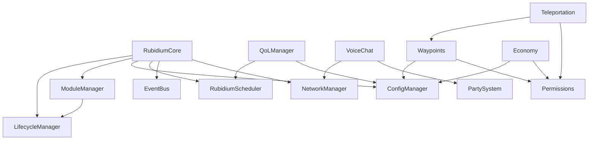

# Rubidium Framework Documentation Index

> **AI-Readable Documentation** - This documentation is structured for both human and AI consumption with consistent formatting, explicit type signatures, and comprehensive examples.

## Document Structure

```
/rubidium/documentation/
├── INDEX.md                    # This file - navigation and overview
├── ARCHITECTURE.md             # System architecture and design patterns
├── VOICE_CHAT.md               # Proximity and channel-based voice chat
├── WAYPOINTS.md                # Waypoint and navigation system
├── PARTY_SYSTEM.md             # Party/group coordination system
├── ECONOMY.md                  # Economy, transactions, and shops
├── TELEPORTATION.md            # Warps, homes, and teleportation
├── CHAT_SYSTEM.md              # Advanced chat with channels and filters
├── PERMISSIONS.md              # Role-based permission system
├── PERFORMANCE.md              # Performance optimization system
├── COMMANDS.md                 # Command reference
└── API_REFERENCE.md            # Complete API reference
```

## Quick Reference

### Framework Version
- **Current Version**: 1.0.0
- **Java Version**: 21+
- **Target Platform**: Hytale (API-safe, no game internals)

### Package Structure
```
com.yellowtale.rubidium
├── api/                 # Public API interfaces
├── core/                # Core framework implementation
├── qol/                 # Quality of Life features
├── replay/              # Moderator replay system
├── voice/               # Voice chat system
├── waypoints/           # Waypoint system
├── party/               # Party/group system
├── economy/             # Economy system
├── teleport/            # Teleportation system
├── chat/                # Chat system
├── permissions/         # Permission system
├── integration/         # External integrations
└── plugin/              # Plugin loader
```

### Core Concepts

| Concept | Description | Primary Class |
|---------|-------------|---------------|
| Module | Hot-reloadable component | `AbstractModule` |
| QoL Feature | Toggleable server feature | `QoLFeature` |
| Event | Pub/sub event system | `EventBus` |
| Task | Scheduled execution | `RubidiumScheduler` |
| Config | Type-safe configuration | `AbstractConfig` |
| Command | Player/console commands | `CommandManager` |

### Entry Points

```java
// Main framework entry
RubidiumCore core = RubidiumCore.create(dataDir, logger);
core.start();

// Access managers
ModuleManager modules = core.getModuleManager();
QoLManager qol = core.getQoLManager();
EventBus events = core.getEventBus();
RubidiumScheduler scheduler = core.getScheduler();
```

## System Dependencies



## Feature Matrix

| Feature | Status | Toggleable | Persistent | Commands |
|---------|--------|------------|------------|----------|
| AFK Detection | ✅ | Yes | Yes | `/afk` |
| Chat Formatting | ✅ | Yes | Yes | - |
| Join/Leave Messages | ✅ | Yes | Yes | - |
| MOTD | ✅ | Yes | Yes | `/motd` |
| Command Cooldowns | ✅ | Yes | Yes | - |
| Maintenance Mode | ✅ | Yes | Yes | `/maintenance` |
| Staff Tools | ✅ | Yes | No | `/vanish`, `/godmode`, `/freeze` |
| Lag Detection | ✅ | Yes | Yes | - |
| Auto-Save | ✅ | Yes | Yes | - |
| Player Statistics | ✅ | Yes | Yes | `/stats` |
| Moderator Replay | ✅ | Yes | Yes | `/replay` |
| Voice Chat | ✅ | Yes | Yes | `/voice` |
| Waypoints | ✅ | Yes | Yes | `/waypoint`, `/wp` |
| Party System | ✅ | Yes | No | `/party`, `/p` |
| Economy | ✅ | Yes | Yes | `/balance`, `/pay`, `/shop` |
| Teleportation | ✅ | Yes | Yes | `/home`, `/warp`, `/tp` |
| Chat Channels | ✅ | Yes | Yes | `/channel`, `/ch` |
| Permissions | ✅ | Yes | Yes | `/perm`, `/role` |

## Navigation

- **Getting Started**: See [ARCHITECTURE.md](ARCHITECTURE.md)
- **Voice Chat**: See [VOICE_CHAT.md](VOICE_CHAT.md)
- **Waypoints**: See [WAYPOINTS.md](WAYPOINTS.md)
- **Party System**: See [PARTY_SYSTEM.md](PARTY_SYSTEM.md)
- **Economy**: See [ECONOMY.md](ECONOMY.md)
- **Teleportation**: See [TELEPORTATION.md](TELEPORTATION.md)
- **Chat System**: See [CHAT_SYSTEM.md](CHAT_SYSTEM.md)
- **Permissions**: See [PERMISSIONS.md](PERMISSIONS.md)
- **Performance**: See [PERFORMANCE.md](PERFORMANCE.md)
- **API Reference**: See [API_REFERENCE.md](API_REFERENCE.md)
- **Command Reference**: See [COMMANDS.md](COMMANDS.md)
